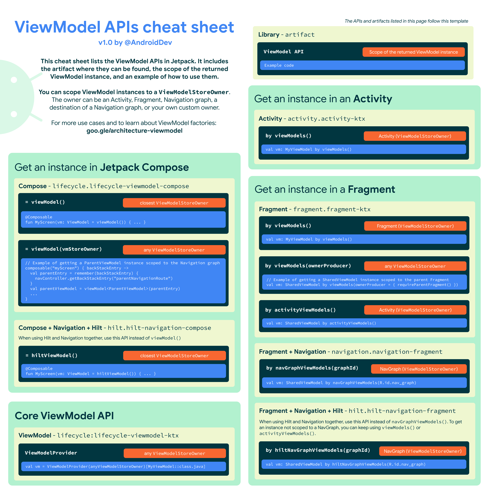

## 简介

官网的介绍是：ViewModel是用来存储业务逻辑或者屏幕级的状态容器。基本上说的很清楚，两点：

1. 存储业务逻辑：为ViewController层解耦，同时提供业务逻辑的访问。
2. 屏幕级的状态容器：可以存储UI的状态，但是是给actvitiy/fragment这种屏幕级的组件用的，不是给普通的View用的。

他的一个重要的有点是：他的生命周期是从activity create直到finish，注意这里的finish并不是destory，而是调用finish()结束activity。因此可以做到当由于配置变化或其他原因导致的activity被destory时，它依然存在，方便activity recreate时的复用其中的数据。而不必再次获取数据。

### ViewModel中的业务逻辑

有两种，一个是普通的业务逻辑，这部分应该是在数据层中处理的，这部分逻辑ViewModel一般就是委托给其他的数据层的类，比如Repository等。

另一种是界面层自己处理的业务逻辑，比如对数据层返回的数据的加工处理 或者 对多个数据层返回的数据的组合，以及一些不需要数据层参与的业务逻辑。


## ViewModel Scope

- ViewModel的作用域取决于它被创建时传入的 ViewModelStoreOwner 对象。
- 通过 Activity 库、Fragment 库和 Navigation 库提供的 [`viewModels()`](https://developer.android.google.cn/reference/kotlin/androidx/activity/package-summary?hl=zh-cn#(androidx.activity.ComponentActivity)) 扩展函数，以及 Compose 中的 `viewModel()` 函数，可以在代码中自动获取到最近的 ViewModleStoreOwner 的作用域。
- 具体的不同的API最下面会有一张图列出来。


## ViewModle 的 Save State module

这块我理解的也不太清除，就简单列下官网文档的内容吧。

从 [Fragment 1.2.0](https://developer.android.google.cn/jetpack/androidx/releases/fragment?hl=zh-cn#1.2.0) 或其传递依赖项 [Activity 1.1.0](https://developer.android.google.cn/jetpack/androidx/releases/activity?hl=zh-cn#1.1.0) 开始，可以直接定义ViewModle的类型为SavedStateViewModel，然后构造传入一个SaveStateHandle对象。

```kotlin
class SavedStateViewModel(private val state: SavedStateHandle) : ViewModel() { ... }
```

然后在ViewController层使用普通的扩展方法即可，比如：

```kotlin
class MainFragment : Fragment() {
    val vm: SavedStateViewModel by viewModels()

    ...
}
```


## 创建带依赖项的ViewModel

### 两种无需特殊处理依赖项的情况

1. 使用Hilt，这时候里面的依赖项都不需要我们手动处理。
2. `ViewModle`中仅使用`SavedStateHandler`一个依赖项，这时候用

`ViewModel`都是通过`ViewModelProvider.Factory`来创建的，包括各种库提供的创建`ViewModel`的API都是这么做的。

### 自定义ViewModelFactory

由于不常用，这里就列一下sample code就行了，具体可以去看官网文档。

```kotlin
 import androidx.lifecycle.SavedStateHandle
    import androidx.lifecycle.ViewModel
    import androidx.lifecycle.ViewModelProvider
    import androidx.lifecycle.ViewModelProvider.AndroidViewModelFactory.Companion.APPLICATION_KEY
    import androidx.lifecycle.createSavedStateHandle
    import androidx.lifecycle.viewmodel.CreationExtras

    class MyViewModel(
        private val myRepository: MyRepository,
        private val savedStateHandle: SavedStateHandle
    ) : ViewModel() {

        // ViewModel logic
        // ...

        // Define ViewModel factory in a companion object
        companion object {

            val Factory: ViewModelProvider.Factory = object : ViewModelProvider.Factory {
                @Suppress("UNCHECKED_CAST")
                override fun <T : ViewModel> create(
                    modelClass: Class<T>,
                    extras: CreationExtras
                ): T {
                    // Get the Application object from extras
                    val application = checkNotNull(extras[APPLICATION_KEY])
                    // Create a SavedStateHandle for this ViewModel from extras
                    val savedStateHandle = extras.createSavedStateHandle()

                    return MyViewModel(
                        (application as MyApplication).myRepository,
                        savedStateHandle
                    ) as T
                }
            }
        }
    }
```

> 这里的写法是2.5.0以后的 ViewModle 的版本的写法，之前的不一样，去看文档。


## ViewModel API 备忘录


