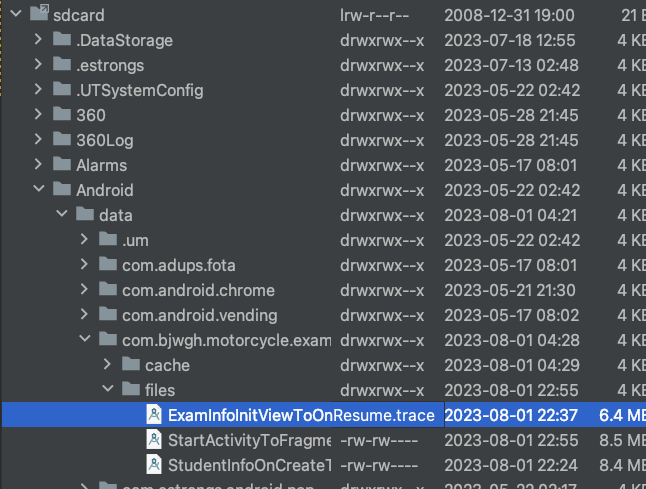
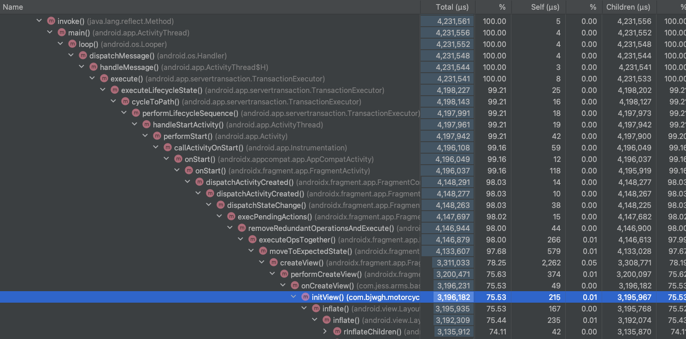

## 定位方法耗时

### 1. 通过MethodTrace定位耗时方法:

```java
//开始methodTrace
Debug.startMethodTracing("StudentInfoOnCreateToOnResume");
//停止methodTrace
Debug.stopMethodTracing();
```

### 2. 导出

抓取到的trace文件的位置sdcard - Android - data - $appDir - files，如图：



### 3. 使用AS Profiler分析

用As的Profiler打开后，长这样：


- 左面一列是目前打开的trace，也有与当前设备连接的session。
- 中间上方是cpu使用情况，导入的trace没有，我就给缩小了
- 下面是全部的线程，这里看到是29个线程，其中的main，就是我们app的主线程
- 右面是线程分析，默认有全部线程的分析，我们在中间选择main以后，右面就有main的分析了


基本流程就是：

1. 选中我们要分析的线程，这里选main，
2. 右面选Top Down，就可以看到耗时的排名，这个耗时的单位是us，也就是ms的千分之一
3. 看耗时高的这几个，也就是右面的total和%高的方法，一层层点下去，就是这个方法的调用链，就知道哪个方法耗时了。


比如下面这个图，就看到了是ZygoteInit通过反射调用了ActivityThread的main()方法，然后在looper中调用生命周期回调，最终调用了我们在生命周期中写的initView方法，去inflate了view，主要耗时最终就在inflate中。

