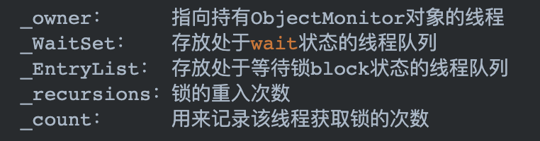
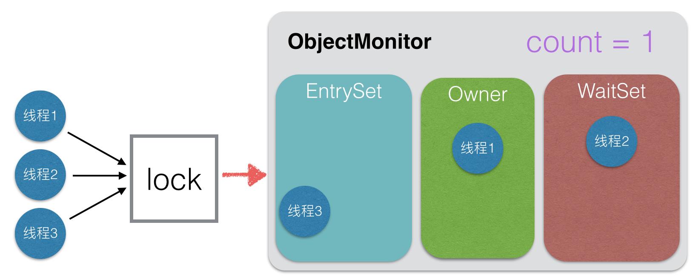

### 对象头存储标记字段（Mark Work）

JDK1.6之前java用的synchronized都是重量级锁，所谓重量级锁，而1.6以后加入了轻量级锁和偏向锁。为此，在我们堆内存的对象的对象头中有一个_mark字段，称为标记字段（Mark Work），他可以存储锁的状态和信息，32位的JVM的Mark Word的存储结构如下：

可以看到对于不同的锁状态，会有不同的存储结构。其中重量级锁的Monitor指针是一个c++对象：ObjectMonitor。ObjectMonitor对象中有几个关键的属性：

### 重量级锁

为方便理解，举例说明重量级锁的运行：

1. 我们有一个银行，其中有一个业务办理席位、一个等候大厅和一个休息室
2. 首先客户都先进入等候大厅等候，进入后尝试直接进入办理席位办理，当客户在业务办理席位办理完毕后可从侧门直接离开银行
3. 业务办理席位空闲时，所有客户一起争抢，看谁能进入业务办理席，进入后其余客户继续等待。
4. 有部分特殊需求的客户，他们的业务需要不定时间的等候，这种情况，当办理到需要等候的步骤时，客户从业务办理席位进入休息室等待，业务办理席继续叫号，等到他的业务可以办理时，他需要从休息室重新进入等候大厅重新跟其他客户争抢业务办理席位

这个银行的栗子基本说明了依赖于ObjectMonitor的重量级锁的流程，秩序替换一下各个重要的元素即可：

- 客户 = 需要执行加了锁的代码的线程
- 业务办理席位 = 成功获取了锁对象，有权执行同步代码的线程 = _owner字段
- 等候大厅 = block的等待执行的线程集合 = _EntryList字段
- 休息室 = wait状态的线程集合 = _WaitSet字段

重新替换元素后的流程：

1. 所有需要执行加了锁的代码的线程会先进入_EntrySet进行争抢，此时他们为block状态
2. 争抢成功的线程，从block状态进入runnable状态，将__owner字段置为自己，_count++，从\_EntrySet中移除自己_
3. 执行完毕，_owner字段置为nul, count--
4. 如果当前线程调用了wait方法，则线程进入wait状态，将_owner字段置空，count--，进入\_WaitSet集合
5. wait状态的线程，当被notify以后，会重新从\_WaitSet进入\_EntrySet，尝试抢夺锁对象。

下面放一张示例图，方便可见性地理解一下：

### Java 虚拟机对 synchronized 的优化

重量级锁是很耗费性能的，比如如果要阻塞或唤醒一个线程就需要让cpu从用户态转换到核心态，这是一个很重的操作。所以从 Java 6 开始，虚拟机对 synchronized 关键字做了多方面的优化，主要目的就是，避免 ObjectMonitor 的访问，减少“重量级锁”的使用次数，并最终减少线程上下文切换的频率 。其中主要做了以下几个优化： 锁自旋、轻量级锁、偏向锁。

#### 锁自旋

所谓自旋，就是让该线程等待一段时间，不会被立即挂起，看当前持有锁的线程是否会很快释放锁。而所谓的等待就是执行一段无意义的循环即可（自旋）。

我理解就跟cas的时候的那种`while(true)`循环一样，就一直在重试，尝试获取到锁。

> 自旋锁也存在一定的缺陷：自旋锁要占用 CPU，如果锁竞争的时间比较长，那么自旋通常不能获得锁，白白浪费了自旋占用的 CPU 时间。这通常发生在锁持有时间长，且竞争激烈的场景中，此时应主动禁用自旋锁。

#### 轻量级锁

有时候 Java 虚拟机中会存在这种情形：对于一块同步代码，虽然有多个不同线程会去执行，但是这些线程是在不同的时间段交替请求这把锁对象，也就是不存在锁竞争的情况。在这种情况下，锁会保持在轻量级锁的状态，从而避免重量级锁的阻塞和唤醒操作。

当线程执行某同步代码时，Java 虚拟机会在当前线程的栈帧中开辟一块空间（Lock Record）作为该锁的记录，然后 Java 虚拟机会尝试使用 CAS（Compare And Swap）操作，将锁对象的 Mark Word 拷贝到这块空间中，并且在锁记录中的和 Mark Word 中都加入一个指针指向对方。结果如下：

当线程再次执行此同步代码块时，判断当前对象的 Mark Word 是否指向当前线程的栈帧，如果是则表示当前线程已经持有当前对象的锁，则直接执行同步代码块；否则只能说明该锁对象已经被其他线程抢占了，这时轻量级锁需要膨胀为重量级锁。

#### 偏向锁

有一种场景是这样，一段同步的代码绝大多数情况都只有一个线程在操作，但也有一些情况下，会有其他线程来操作。这种情况就适合使用偏向锁。偏向锁所做的优化也就是当同一个线程在不断进入或退出同步的代码块时，并不会进行强占锁和释放锁的操作。

它的实现方式是在第一次获取锁的时候，在锁对象的对象头中写入 ThreadId 字段，当再次尝试获取锁之前，会先查看这个锁对象的 ThreadId 是否是自己这个线程，如果是，就不需要再次获取锁，略过了轻量级锁和重量级锁的加锁阶段。提高了效率。

> 其实偏向锁并不适合所有应用场景, 因为一旦出现锁竞争，偏向锁会被撤销，并膨胀成轻量级锁，而撤销操作（revoke）是比较重的行为，只有当存在较多不会真正竞争的 synchronized 块时，才能体现出明显改善；因此实践中，还是需要考虑具体业务场景，并测试后，再决定是否开启/关闭偏向锁。

