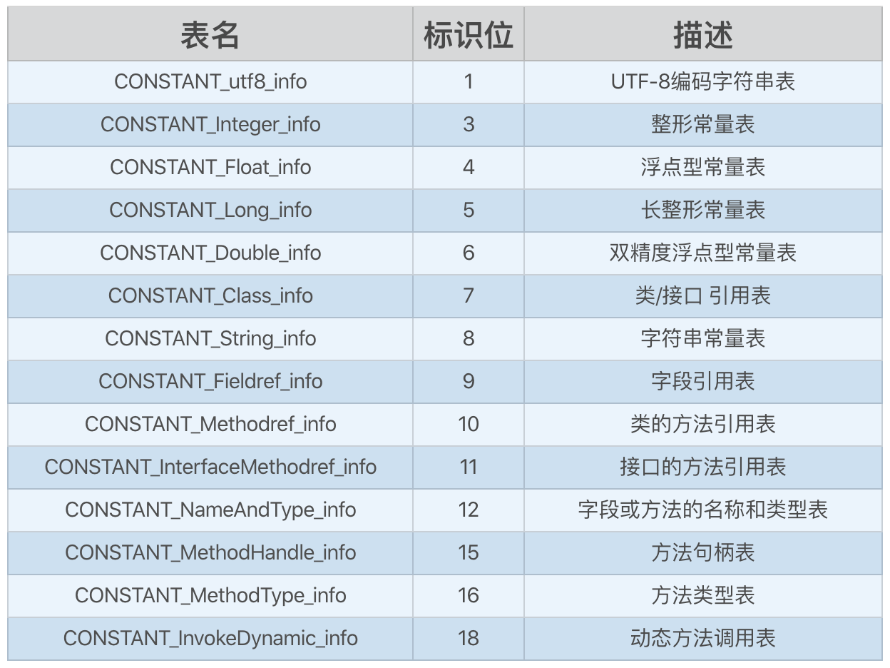

### class文件的作用：

1. 对于java的跨平台性起了重要的作用，不同平台的虚拟机都可以直接运行class文件，
2. 解除了 Java 虚拟机和 Java 语言之间的耦合，因为不同的语言都可以编译成class文件

### class文件的基本组成

- 无符号数： u1,u2,u4,u8，分别代表1个字节、2个字节、4个字节和8个字节，可以把他理解为大小不同的byte数组
- 表： 由其他表和无符号数组成，所有的表都是以info结尾命名

伪代码：

```
// 无符号数

u1 = byte[1];

u2 = byte[2];

u4 = byte[4];

u8 = byte[8];


// 表

class_table {

    // 表中可以引用各种无符号数，

    u1 tag;

    u2 index2;

    ...


    // 表中也可以引用其它表

    method_table mt;

    ...

}
```

### class文件结构

从头到尾依次如下：

魔数 - 版本号 - 常量池 - 访问标志 - 类/父类/接口 - 字段描述集合 - 方法描述集合 - 属性描述集合

这里每种结构都是一个无符号数或者表，比如魔数就是一个u4类型的无符号数，具体如下图：


### class文件实例分析

看拉勾教育的Android工程师进阶34讲第3讲中的栗子，讲的很清楚。

### 对我来说的一些重要的点：

**1. 常量池中的所有的数据都是表，具体有14种表：**



**2.每个String常量都是用一个CONSTANT_Class_info表来存的:**

```
table CONSTANT_utf8_info {

    u1  tag;

    u2  length;

    u1[] bytes;

}
```

其中length代表具体这个string的长度，byte[]存的就是具体这个string本身。

这也回答了那个经典问题：java中编译期String常量的长度最长是多少，因为这个length是一个u2，所以最长就是16个字节的无符号数的最大值，也就是2<sup>16</sup> - 1，65535个，String为null的时候length是0。