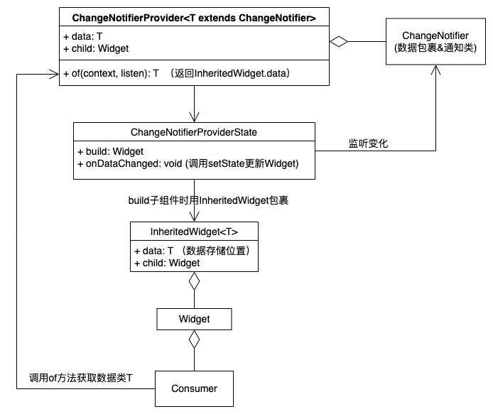

# 跨组件状态共享

这里的状态也指的是数据或对象，Flutter为了处理跨组件状态共享的问题，基于`inheritedWidget`开发了一套 Provider 框架。

主要包含三个部分：

- ChangeNotifier
- ChangeNotifierProvider
- Consumer

## ChangeNotifier

就是一个被观察者，可以向观察者发送通知。主要有几个方法：

- `addListener` ：添加监听者
- `removeListener`： 移除监听者
- `notifyListeners`： 通知监听者

数据包裹类要继承`ChangeNotifier`，在数据变动时调用`notifyListeners`通知观察者。如下：

```dart
class CartModel extends ChangeNotifier {
  final List<Item> _items = [];

  UnmodifiableListView<Item> get items => UnmodifiableListView(_items);

  double get totalPrice =>
      _items.fold(0, (value, item) => value + item.count * item.price);

  add(Item item) {
    _items.add(item);
    //数据变化，通知listeners
    notifyListeners();
  }
}
```

## ChangeNotifierProvider

这个 Widget 在创建时传入一个方法创建一个`ChangeNotifier`实例，用来返回给向其子孙 Widget ，然后子孙 Widget 就获取到了数据类，可以做各种数据操作。用法如下：

```dart
void main() {
  runApp(
    ChangeNotifierProvider(
      create: (context) => CartModel(),
      child: const MyApp(),
    ),
  );
}
```

还可以使用`MultiProvider`提供多个`ChangeNotifier`实例：

```dart
void main() {
  runApp(
    MultiProvider(
      providers: [
        ChangeNotifierProvider(create: (context) => CartModel()),
        Provider(create: (context) => SomeOtherClass()),
      ],
      child: const MyApp(),
    ),
  );
}
```

## Consumer

有了数据类`ChangeNotifier`，有了向子孙 Widget 暴露数据类的`ChangeNotifierProvider`，剩下的就是数据的消费端`Consumer`了。

使用`Consumer` widget 包裹子组件，子组件即可使用`ChangeNotifier`进行数据操作：

```dart
return Consumer<CartModel>(
  builder: (context, cart, child) {
    return Text('Total price: ${cart.totalPrice}');
  },
);
```

第三个参数是 `child`，用于优化目的。如果 `Consumer` 下面有一个庞大的子树，当模型发生改变的时候，该子树 **并不会** 改变，那么你就可以仅仅创建它一次，然后通过 builder 获得该实例。

注意`Consumer`包裹的子Widget会成为`ChangeNotifier`的监听者，在`ChangeNotifier`调用`notifyListeners`时rebuild。

##  Provider.of

一些子 Widget 可能只需要操作数据，但不需要根据数据的变化而rebuild。此时可以使用 `Provider.of`，并且将 `listen` 设置为 `false`：

```dart
Provider.of<CartModel>(context, listen: false).removeAll();
```

在 build 方法中使用上面的代码，当 `notifyListeners` 被调用的时候，并不会使 widget 被重构。

# 原理

在《Flutter实战》中写了一个简单的`ChangeNotifierProvider`的实现。原理图如下：



## 简单实现的Provider源码：

### 1. 数据包裹类 InheritedWidget

用来包裹数据类`ChangeNotifier`：

```dart
class InheritedProvider<T> extends InheritedWidget {
  final T data;

  const InheritedProvider(
      {super.key, required this.data, required super.child});

  @override
  bool updateShouldNotify(covariant InheritedWidget oldWidget) => true;
}
```

### 2. ChangeNotifierProvider

```dart
class ChangeNotifierProvider<T extends ChangeNotifier> extends StatefulWidget {
  const ChangeNotifierProvider(
      {super.key, required this.data, required this.child});

  final Widget child; //传进来的子Widiget
  final T data; //即ChangeNotifier的包裹类

  @override
  State<StatefulWidget> createState() => _ChangeNotifierProviderState<T>();

  /**
  * 给子Widget及Consumer使用的获取数据类ChangeNotifier的方法，
  * 通过InheritedWidget不同的方法，实现子Widget是否依赖ChangeNotifier的操作。
  */
  static T? of<T>(BuildContext context, {bool listen = true}) {
    final provider = listen? context.dependOnInheritedWidgetOfExactType<InheritedProvider<T>>() :
      context.getElementForInheritedWidgetOfExactType<InheritedProvider<T>>()?.widget as InheritedProvider<T>;
    return provider?.data;
  }
}
```

### 3. _ChangeNotifierProviderState

```dart
class _ChangeNotifierProviderState<T extends ChangeNotifier>
    extends State<ChangeNotifierProvider<T>> {
  update() {
    setState(() {});
  }

  @override
  void didUpdateWidget(covariant ChangeNotifierProvider<T> oldWidget) {
    if (widget.data != oldWidget.data) {
      oldWidget.data.removeListener(update);
      widget.data.addListener(update);
    }
    super.didUpdateWidget(oldWidget);
  }

  @override
  void initState() {
    widget.data.addListener(update);
    super.initState();
  }

  @override
  void dispose() {
    widget.data.removeListener(update);
    super.dispose();
  }

  @override
  Widget build(BuildContext context) {
    // logger.d('_ChangeNotifierProviderState build');
    return InheritedProvider<T>(data: widget.data, child: widget.child);
  }
}
```

可以看到主要做了两件事：

1. build时返回的子组件外套一层前面的数据包裹类`InheritedProvider`
2. 根据生命周期添加或删除对`ChangeNotifier`的监听，在监听到变化后通过`setState`更新子Widget

### 4. Comsumer

```dart
class Consumer<T> extends StatelessWidget {

  final Widget Function(BuildContext context, T? value) builder;

  const Consumer({super.key, required this.builder});

  @override
  Widget build(BuildContext context) {
    return builder(
      context,
      ChangeNotifierProvider.of<T>(context)
    );
  }
}
```

通过`ChangeNotifierProvider.of`获取数据类并进行操作。


## 原理总结

1. 数据类继承`ChangeNotifier`以拥有通知更新的方法。
2. `ChangeNotifierProvider`在build子组件时套上一层`InheritedWidget`，后者内部传入用户真正需要的数据类（`ChangeNotifier`子类）。
3. `ChangeNotifierProvider`实现了一个`of`方法，此方法中子组件就可以通过`InheritedWidget`的方法获取到数据类对象。
4. `ChangeNotifierProvider`的State类监听数据类的通知，回调中通过`setState`更新子Widget。
5. `Consumer`中使用`ChangeNotifierProvider#of`方法，调用到`InheritedWidget`中存储的数据类对象。