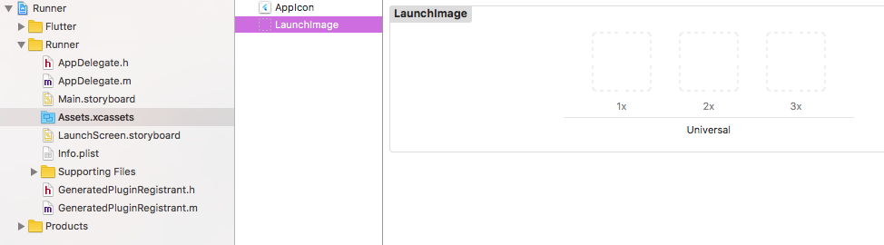

## 指定 assets

和包管理一样，Flutter 也使用 pubspec.yaml 文件中的来管理应用程序所需的资源，使用`assets`关键字：

```yaml
flutter:
  assets:
    - assets/my_icon.png
    - assets/background.png
```

在构建期间，Flutter 将 asset 放置到称为 *asset bundle* 的特殊存档中，应用程序可以在运行时读取它们

## Asset 变体

就是包含在不同目录下的同名 asset 可以视为不同的 asset 变体，用来在不同的 context 下使用。

比如，如果应用程序目录中有以下两个文件:

- …/graphics/background.png
- …/graphics/dark/background.png

然后`pubspec.yaml`文件中只需包含:

```yaml
flutter:
  assets:
    - graphics/background.png
```

那么这两个`graphics/background.png`和`graphics/dark/background.png` 都将包含在您的 asset bundle中。前者被认为是_main asset_ （主资源），后者被认为是一种变体（variant）。

这是因为在`pubspec.yaml`的`assets` 部分中指定 asset 路径时，构建过程中，会在相邻子目录中查找具有相同名称的任何文件，与指定的 asset 一起被包含在 asset bundle 中

## 加载assets

应用访问 asset 可以通过 `AssetBundle` 对象。

### 加载文本assets

通常的做法是：

1. 首先尝试使用`DefaultAssetBundle`加载，通过`DefaultAssetBundle.of()` 获取当前 BuildContext 的AssetBundle。 这种方法不是使用应用程序构建的默认 asset bundle，而是使父级 widget 在运行时动态替换的不同的 AssetBundle

1. 在widget 上下文之外，或其他`AssetBundle`句柄不可用时，可以使用`package:flutter/services.dart`中全局静态的`rootBundle`对象直接加载这些 asset

   ```dart
   import 'dart:async' show Future;
   import 'package:flutter/services.dart' show rootBundle;
   
   Future<String> loadAsset() async {
     return await rootBundle.loadString('assets/config.json');
   }
   ```

### 加载图片

#### 声明不同分辨率的图片assets

通过以下目录结构保存的asset可以作为在不同分辨率的同一图片：

- …/my_icon.png
- …/2.0x/my_icon.png
- …/3.0x/my_icon.png

对于这类图片asset有以下结论：

- 主资源默认对应于1.0倍的分辨率图片。
- 如果未在`Image` widget上指定渲染图像的宽度和高度，那么`Image` widget将占用与主资源相同的屏幕空间大小，也就是1倍图的大小。
- 当主资源缺少某个资源时，会按分辨率从低到高的顺序去选择 ，也就是说1x中没有的话会在2x中找，2x中还没有的话就在3x中找。

#### 加载图片

有两种情况，一种是需要一个`ImageProvider`，另一个是需要`Widget`。

需要`ImageProvider`时使用`AssetImage`类：

```dart
Widget build(BuildContext context) {
  return DecoratedBox(
    decoration: BoxDecoration(
      image: DecorationImage(
        image: AssetImage('graphics/background.png'),  //使用AssetImage加载图片
      ),
    ),
  );
}
```

需要`Widget`时使用`Image.asset()`：

```dart
Widget build(BuildContext context) {
  return Image.asset('graphics/background.png');
}
```

使用默认的 asset bundle 加载资源时，内部会自动处理分辨率等，这些处理对开发者来说是无感知的。 (如果使用一些更低级别的类，如 时你会注意到有与缩放相关的参数)

#### 依赖包中的资源图片

使用`AssetImage`时提供`package`参数。

例如，假设您的应用程序依赖于一个名为“my_icons”的包，它具有如下目录结构：

- …/pubspec.yaml
- …/icons/heart.png
- …/icons/1.5x/heart.png
- …/icons/2.0x/heart.png
- …

然后加载图像，使用:

```dart
AssetImage('icons/heart.png', package: 'my_icons')
```

或

```dart
Image.asset('icons/heart.png', package: 'my_icons')
```

> 注意：包在使用本身的资源时也应该加上`package`参数来获取。

#### 打包包中的资源图片

对于lib包中的资源图片，想要打到包中并在运行时使用，则需要在`pubspec.yaml`中声明。

例如，一个名为“fancy_backgrounds”的包，可能包含以下文件：

- …/lib/backgrounds/background1.png
- …/lib/backgrounds/background2.png
- …/lib/backgrounds/background3.png

要包含第一张图像，必须在`pubspec.yaml`的assets部分中声明它：

```yaml
flutter:
  assets:
    - packages/fancy_backgrounds/backgrounds/background1.png
```

`lib/`是隐含的，所以它不应该包含在资产路径中。

### 特定平台 assets

对于设置APP图标和添加启动图的操作，需要使用特定平台(Android、IOS等)各自的assets。

#### 设置APP图标

- Android

​	老本行就不说了

- IOS

​	在Flutter项目的根目录中，导航到`.../ios/Runner`。该目录中`Assets.xcassets/AppIcon.appiconset`已经包含占位符图片（见图2-16）， 只需将它们替换为适当大小的图片，保留原始文件名称。

​	

#### 设置启动页

在 Flutter 框架加载时，Flutter 会使用native平台自己的机制绘制启动页。此启动页将持续到Flutter渲染应用程序的第一帧时。

也就是说，如果我们没有渲染，则应用会永远卡在启动页。我们只需要在`main()`方法中调用runApp函数 （或者更具体地说，如果调用`window.render` 去响应`window.onDrawFrame` ）即可

- Android

​	老样子，去Android目录下改。

- IOS

要将图片添加到启动屏幕（splash screen）的中心，请导航至`.../ios/Runner`。在`Assets.xcassets/LaunchImage.imageset`， 拖入图片，并命名为`LaunchImage.png`、`LaunchImage@2x.png`、`LaunchImage@3x.png`。 如果你使用不同的文件名，那您还必须更新同一目录中的`Contents.json`文件，图片的具体尺寸可以查看苹果官方的标准。

您也可以通过打开Xcode完全自定义storyboard。在Project Navigator中导航到`Runner/Runner`然后通过打开`Assets.xcassets`拖入图片，或者通过在LaunchScreen.storyboard中使用Interface Builder进行自定义，如下图所示。



## 平台共享 assets

自行查阅[官方文档](https://flutter.cn/docs/development/ui/assets-and-images#sharing-assets-with-the-underlying-platform)