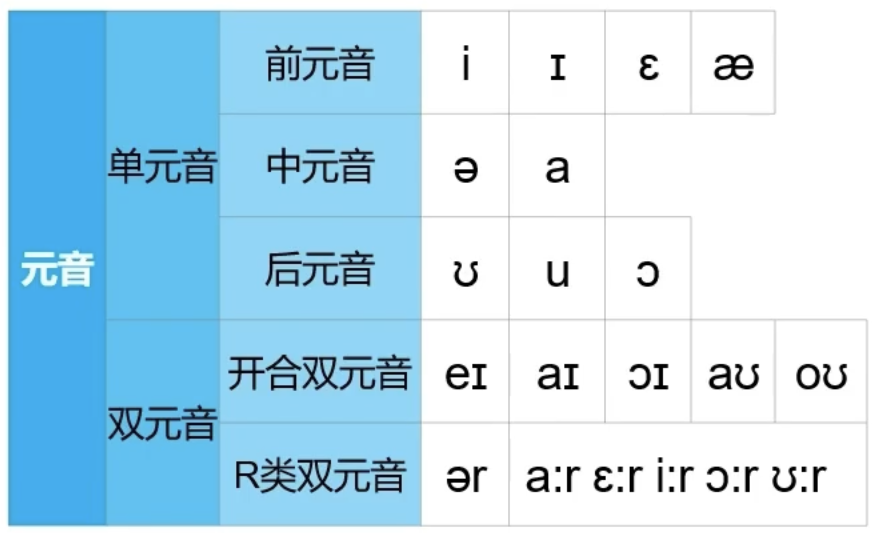
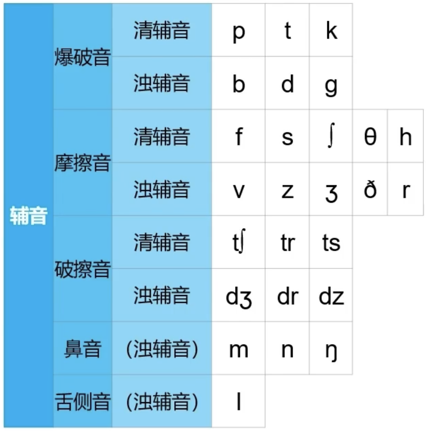

## 元音

- 单元音：一个单独的声音
- 双元音：两个元音拼在一起
- 前元音、中元音、后元音指的是发声的位置，从靠近舌尖到靠近喉咙
- 每个单词中都至少会有一个元音

### 元音整体分类：

### 前元音

- /i/： E  Me  See
- /ɪ/： It  Six  Give
- /ɛ/：Every  Red  Bed
- /æ/：Cat  Laugh  Bag(包)

### 中元音

- /ə/：Under  About  Family
- /a/：Party  Art  Stop

### 后元音

- ***/ʊ/(易错)：发音类似于ə，但是发生位置更靠近喉咙***，Book  Good  Should
- /u/：Cool  Food  You
- /ɔ/：Before  Poor  Morning

### 开合双元音

- 双元音：两个元音撞在一起的发音
- /ei/： A  Name  Day
- /ai/： I  My  Life
- /ɔi/： Boy  Toy  Oil
- /aʊ/：Ow!  Down About
- /oʊ/： O  Over  Konw

### R类双元音

- /ər/：Girl  First  Early
- /a:r/：Are  Car  Art
- /ɛ:r/：Air  There  Fair
- /i:r/：Ear  Hear  Near
- /ɔ:r/：Door  Before  Morning
- /u:r/：Sure  Pure  Fewer

## 辅音

### 辅音整体分类：

### 爆破音

- 爆破音是喉咙不发声的，浊辅音是喉咙发声的
- 爆破音当放在单词的最后的时候，是可以不爆发出来的
- 清辅音：
  - /p/：Party  Stop  Backpack(背包)
  - /t/：Time  Cat  Date
  - /k/：Cat  Back  Gecko(壁虎)

- 浊辅音
  - /b/：But  Boy  Job
  - /d/：Duck  Add  Good
  - /g/：Go  Again  Big

### 摩擦音

- 摩擦是指气会擦过嘴的某个地方
- 清辅音
  - /f/： Fun  Before  If
  - /s/： So First  This 
  - /ʃ/： She  Fashion  Wish
  - /θ/： Think  Something  Math
  - /h/： Hi  Have  Behind
- 浊辅音
  - /v/：Over  Have  Very
  - /z/：Use  Music  Zoo
  - /ʒ/：Usual
  - /ð/：The  They  Other
  - /r/： Run  Right  Cry

### 破擦音

- 清辅音
  - /tʃ/：Teach  Chair  Achoo
  - /tr/：Try  True  Tree
  - /ʦ/：Cats  Hats  Rats(大鼠)
- 浊辅音
  - /ʤ/：Job  Age  Juice
  - /dr/：Dry  Drive  Address
  - /dz/：ads  Heads  Dads

### 鼻音

- 鼻音只有浊辅音
- /m/：Me  Am  Small
- /n/：No  On  And
- /ŋ/：Thing  Sing  Songs

### 舌侧音

- /l/：Later（非正式的时候，t可以发d的音） Class  All

### 半元音

- /w/：Why  One  Between
- /j/：Yes  Few  Music
